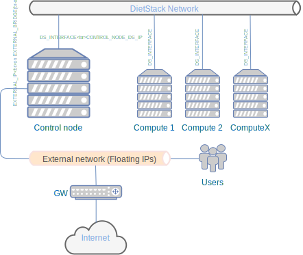

:orphan:

Welcome to DietStack's documentation!
=====================================

Dietstack is minimalistic OpenStack distribution which is focused on simple
deployment and easy upgrades. Services runs in Docker_ containers and basic
deployment is done by simple bash script. There is no need to hassle with
config files, because these are generated by DietStack containers during
startup process. Simple deployment means that unlike other OpenStack distributions,
DietStack supports exactly one configuration based only on free linux software.
It means that by we are using KVM (libvirt) as a hypervisor for Nova,
NFS for Cinder, VXlans and linux bridges for Neutron.
To avoid dependencies as much as possible, it doesn't use standard distro packages to
deploy OpenStack service. Instead  docker containers are built directly from
upstream repositories. This makes DietStack independent from major linux distros.
HA configuration is not supported as it increases complexity significantly and
availability of small installations can be solved other way.

Deployed OpenStack services
---------------------------

- Keystone (Identity Management)
- Glance (Images)
- Nova (Compute)
- Neutron (Networking)
- Cinder (Block Storage)
- Heat (Orchestration)

How DietStack can be used
---------------------------------
Diestack is suitable for OpenStack training and learning purposes as well as for
small private cloud installations. At home I'm using it for all
my VMs like Git server, NAS Server, Torrent Downloader and more. I'm using it
also for development purposes and due to the fact OpenStack has built-in multitenancy,
I can have production and development VMs separated on a network level.

Scalability
-----------
DietStack is built to run OpenStack on cluster up to 10 nodes - 1 control
node and 9 compute nodes. It should be enough for most of SOHO purposes.
Nevertheless technically there is no built-in limit in DietStack itself, so you can
try to deploy it on more nodes if you want.

Instalation
===========

Architecture
------------
Unblike other OpenStack distributions DietStack supports only one configuration.
There is a Control-Node, where Mysql, Rabbitmq and all OpenStack server components are
running. In most basic installation, you can deploy everything on one node so 
Control-Node is also Compute-Node. This way you can run DietStack locally on your
notebook or desktop for development, testing or training purposes.

Networking
----------
Each VMs is connected to one or more private networks which are not directly accessible from 
outside of a cloud. 
VMs that are not on same private network cannot communicate together without router. 
It is very similar to the way how pysical networking is working in real world.
There is a concept of Floating IP, which are public routable IPs and these can be 
optionally assigned to private IPs of VM and have access to VM from outside of a cloud.
This is how it works in DietStack as well. DietStack does not implement Ditributed Virtual
Router (DVR) technology which makes installation more robust, but makes physical networking
more complex.

How to connect DietStack to your network
----------------------------------------
As written in previous topic, Floating IPs needs to be externaly routable in order to users are
able to connect to VMs.
It means that in this physical network there needs to be a pool of IP addresses which is
dedicated for that purpose ( not assigned by your DHCP server).
That pool then needs to be specified during control-node installation in env. varaible <...> .

Requirements
------------

1. Debian 9 or Ubuntu 16.04
2. >=8GB RAM on Control-Node
3. >=Two ethernet interfaces on Control-Node (One for external connectivity and one for DS network)
4. >=One ethernet interface on Compute-Node (DS Network)
5. One interconnect switch (1G/10G) to connect all nodes (DS Network)
6. Couple of ethernet cables to connect nodes with a switch
7. Dedicated block device (mirrored) for Cinder volumes (optional)
8. Dedicated block device for Mysql backups (optional)

1. Local Installation
---------------------
All containers will run on your local computer.

.. code-block:: bash

    git clone https://github.com/dietstack/dietstack.git
    cd dietstack
    ./install_requirements.sh
    ./runds.sh

Now you can connect to Horizon Dashboard :) - http://192.168.99.1:8082

You can also run OpenStack client to manage OpenStack cloud from cli::

    ./dscli.sh

2. DietStack in Vagrant
-----------------------
DietStack runs in two and more VMs. You need to have Vagrant installed, kvm enabled, libvirt
daemon and vagrant-libvirt plugin installed, because Vagrant file is configured to use libvirt
provider.

.. Then you can run::

    git clone https://github.com/dietstack/dietstack.git
    cd dietstack/vagrant
    vagrant up

You can connect to Horizon Dasboard on http://192.168.99.2:8082

You can also run OpenStack client to manage OpenStack cloud from cli::

    vagrant ssh control.dietstack
    cd dietstack
    ./dscli.sh
    
3. Multi-node Installation
--------------------------

  1. Control-node

TODO:
 

.. toctree::
   :maxdepth: 2
   :caption: Contents:

Indices and tables
==================

* :ref:`genindex`
* :ref:`modindex`
* :ref:`search`

.. _Docker: http://www.docker.com/
