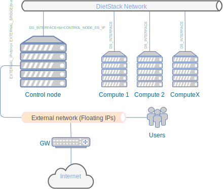

.. _installation:

Instalation
===========

Architecture
------------
Unlike other OpenStack distributions DietStack supports only one configuration.
There is a Control-Node, where Mysql, Rabbitmq and all OpenStack server components are
running. In most basic installation, you can deploy everything on one node so
Control-Node is also Compute-Node. This way you can run DietStack locally on your
notebook or desktop for development, testing or training purposes.

Networking in DietStack projects
--------------------------------
Each instance is connected to one or more private networks which are not directly accessible from
outside of a cloud.
Instances that are not on same private network cannot communicate together without router.
It is very similar to the way how pysical networking is working in real world.
There is a concept of Floating IP, which are public routable IPs and these can be
optionally assigned to private IPs of VM and have access to VM from outside of a cloud.
DietStack does not implement Ditributed Virtual Router (DVR) technology which makes
networking more robust, but makes physical networking more complex.
                                                                                                    
How to connect DietStack to your physical network
-------------------------------------------------
As written in previous topic, Floating IPs needs to be externaly routable in order to users are
able to connect to instances created by DietStack.
It means that you need to choose physical network, where you need to have a pool of IP addresses
which are dedicated for that purpose - will be assigne by Neutron and not by your DHCP server).
Floating IP rabge can be then specified during creation of external network during DietStack 
initial configuration (see ``first_vm.sh`` script in container invoked by ``dscli.sh``)

1. Local Installation
---------------------
All containers will run on your local computer.

Requirements
^^^^^^^^^^^^

1. At least 8GB RAM
2. At least 10GB of free space
3. Debian 9 or Ubuntu 16.04 on your computer
4. ``root`` privileges or ability to get then with ``sudo``

.. code-block:: bash

    git clone https://github.com/dietstack/dietstack.git
    cd dietstack
    sudo ./install_requirements.sh
    sudo ./runds.sh

Now you can connect to Horizon Dashboard :) - http://192.168.99.1:8082

You can also run OpenStack client to manage OpenStack cloud from cli::

    ./dscli.sh

2. DietStack in Vagrant                                                                             
-----------------------                                                                             
DietStack runs in two and more VMs conrolled by Vagrant.                                           

Requirements
^^^^^^^^^^^^

1. At least 8GB RAM
2. At least 10GB of free space
3. kvm enabled and Vagrant with ``vagrant-libvirt`` plugin installed

Then you can run::                                                                               
                                                                                                    
    git clone https://github.com/dietstack/dietstack.git                                            
    cd dietstack/vagrant                                                                            
    vagrant up                                                                                      
                                                                                                    
You can connect to Horizon Dasboard on http://192.168.99.2:8082                                     
                                                                                                    
You can also run OpenStack client to manage OpenStack cloud from cli::                              
                                                                                                    
    vagrant ssh control.dietstack                                                                   
    cd dietstack                                                                                    
    ./dscli.sh                                                                                      
                                                                                                    
3. Multi-Node Installation                                                                          
--------------------------                                                                          

This is installation you will need to use when you would like to use DietStack for the real
purposes.                                                                                   

Requirements
^^^^^^^^^^^^

1. Debian 9 or Ubuntu 16.04 already installed on all nodes
2. At least 8GB RAM on Control-Node
3. At least two ethernet interfaces on Control-Node (One for external connectivity and one for 
   DS network)
4. At least one ethernet interface on Compute-Node (DS Network)
5. One DS switch (1G/10G) to connect all nodes (DS Network)
6. Couple of ethernet cables to connect nodes with a switch
7. Dedicated block device (mirrored) for Cinder volumes (optional)
8. Dedicated block device for Mysql backups (optional)
9. ``root`` privileges or ability to get then with ``sudo`` on all nodes
                                                                                                                                                                                                       

Continue to :ref:`user-guide`
